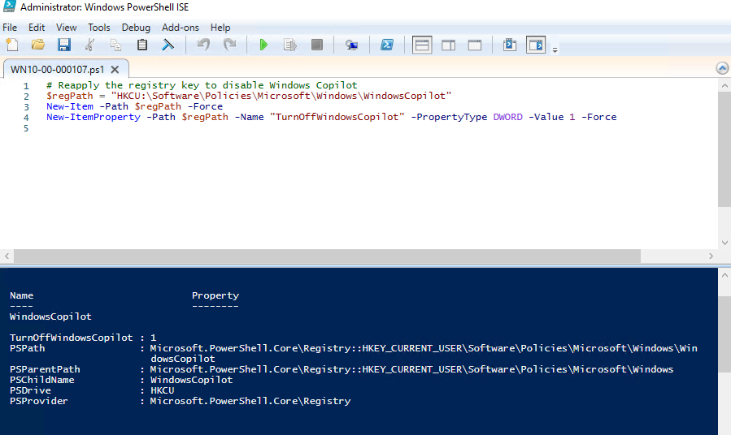
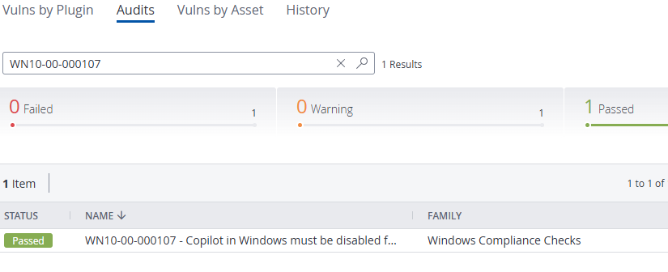

# 🛡️ STIG Fix: WN10-00-000107 – Disable Windows Copilot

## 📋 Overview

This STIG requires that **Windows Copilot** be disabled on Windows 10 systems to reduce unauthorized data leakage and AI-driven system interactions in secure environments.

- **STIG ID:** WN10-00-000107  
- **Severity:** CAT II  
- **Validation Tool:** Tenable.sc  
- **Remediation Method:** Manual (Registry) & Automated (PowerShell)

---

## ❌ Initial Compliance Scan – Failed

A Tenable STIG scan revealed that this host was **non-compliant** with STIG `WN10-00-000107`.

📸 Screenshot:  

---

## 🛠️ Manual Registry Fix

The setting was first remediated manually using the Windows Registry Editor:

1. Open `regedit`
2. Navigate to:  
   `HKEY_CURRENT_USER\Software\Policies\Microsoft\Windows`
3. Create a new key:  
   `WindowsCopilot`
4. Inside that key, create a new `DWORD (32-bit)` value:
   - **Name:** `TurnOffWindowsCopilot`
   - **Value:** `1` (Decimal)
5. Reboot the system

📸 Screenshot:  

---

---

## ⚙️ Automated Remediation via PowerShell

After removing the registry key, the fix was re-applied using PowerShell to simulate an automated remediation.

📸 Screenshot – Script Executed in PowerShell ISE:  

---

## ✅ Final Compliance Scan – Passed

After applying the PowerShell fix, a follow-up Tenable STIG scan confirmed the system is now **compliant** with STIG `WN10-00-000107`.

📸 Screenshot – STIG Passed in Tenable:  

