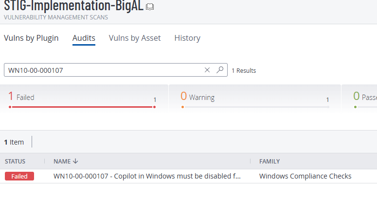
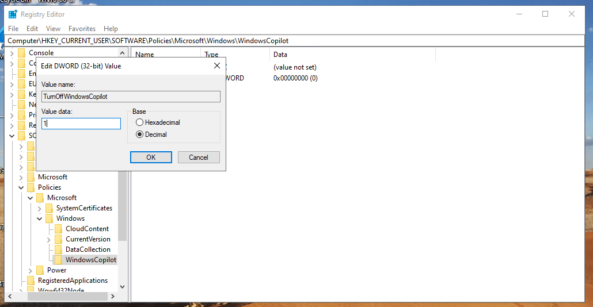

# STIG Fix: WN10-00-000107 – Disable Windows Copilot

## 📋 Description
This STIG requires that Windows Copilot be disabled to prevent unauthorized network communications and data leakage.

- **STIG ID:** WN10-00-000107  
- **Severity:** CAT II  
- **Fix Method:** Registry (Manual + PowerShell)  
- **Tool Used for Validation:** Tenable.sc

---

## 🔍 Vulnerability Overview

By default, Windows Copilot is enabled, allowing users to interact with an AI assistant that may transmit data externally. To comply with DoD security policy, it must be disabled via Group Policy (Registry).

---

## 🧪 Initial STIG Scan – Failed

A baseline scan was performed using Tenable, which flagged the machine as **non-compliant** with STIG ID `WN10-00-000107`.



---

## 🔧 Manual Remediation via Registry

1. Open `regedit`
2. Navigate to:  
   `HKEY_CURRENT_USER\Software\Policies\Microsoft\Windows`
3. Create a new key:
   `WindowsCopilot`
4. Inside that key, create a new **DWORD (32-bit) Value**:
   - **Name:** `TurnOffWindowsCopilot`
   - **Value:** `1` (Decimal)
5. Restart the system

📸 **Manual Fix Screenshot:**  


---

## ⚙️ PowerShell Remediation Script

To validate automation, the manual fix was undone and re-applied using PowerShell.

```powershell
$regPath = "HKCU:\Software\Policies\Microsoft\Windows\WindowsCopilot"
New-Item -Path $regPath -Force
New-ItemProperty -Path $regPath -Name "TurnOffWindowsCopilot" -PropertyType DWORD -Value 1 -Force
windows-WN10-00-000107/
├── README.md
├── screenshots/
│   ├── scanfailed.png
│   ├── registryfix.png
│   ├── powershellfix.png
│   └── scanpassed.png
└── scripts/
    └── disablewindowscopilot.ps1
